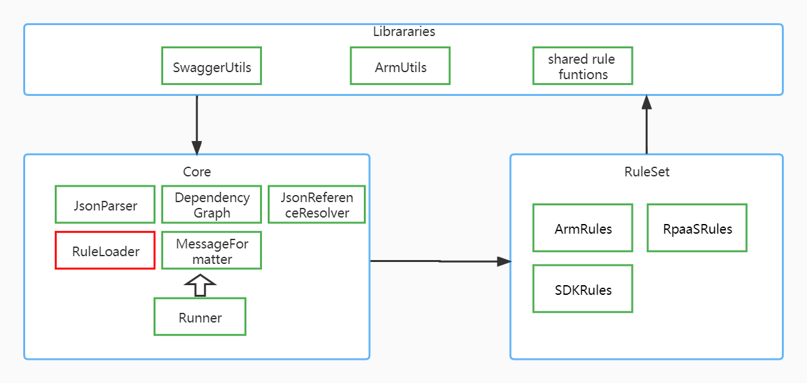

# swagger linter validation

## Overview


- dependency graph
when lint swagger , firstly we will construct the dependency graph which contains the relationship of which swaggers reference the current swagger , and which swaggers are referenced by current swagger  

## Adding new rules
1 add new shared functions or use existing functions.
2 add rule configuration to the specified rule Set.

### Shared rule functions
```
export type IRuleFunction = (
  openapiDocument: any,
  openapiSection: any,
  location: JsonPath,
  ctx?: RuleContext,
  opt?: any
) => Iterable<ValidationMessage> | AsyncIterable<ValidationMessage>
```
### Rule configuration
```
export interface IRule {
  readonly id: string // see rule ID
  readonly description?: string
  readonly category: "ARMViolation" | "OneAPIViolation" | "SDKViolation" | "RPaaSViolation"
  readonly openapiType: OpenApiTypes
  readonly severity: "error" | "warning" | "info"
  readonly given?: string | string[] // see https://github.com/JSONPath-Plus/JSONPath for syntax and samples.
  readonly then: RuleThen // the rule logic
}
```

### Rule Then
```
export type RuleThen = {
  options: any   // options passing to the function
  fieldSelector?: string  // the jsonPath to select 
  execute: IRuleFunction
}
```


## CLI usage
```
azure openapi linter v0.1            
lint [specs..]

lint for swagger

Positionals:
  specs  The paths to the swagger specs.

Options:
  --help                  Show help                                    [boolean]
  --debug                 Output debug log messages.  [boolean] [default: false]
  --version               Show version number                          [boolean]
  --resourceProverFolder  the folder that includes all the swagger belongs to
                          the RP.                                       [string]
  --openapiType           the openapi type                              [string]
  --readme                the readme.md file path.                      [string]
  --tag                   the readme.md file tag.                       [string]
  --option                Key/value pairs that can be passed to linter.  The
                          format is 'key=value'.  This parameter can be used
                          multiple times to add more options.            [array]
```

## suppression

1  suppression in readme.
2  other places.

## TBD
- support suppression ?
- rewrite all C# rules . Total ~61, 23 ARM rules,38 SDK rules
- apply to tooling service , unified pipeline 
- update relevant documentations